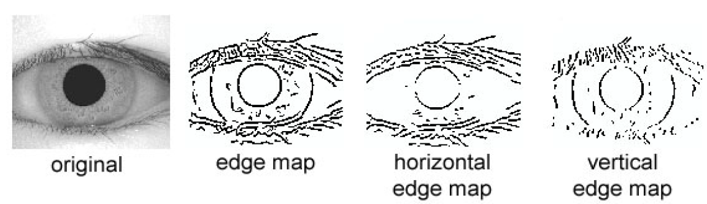

<!-- 
Text can be **bold**, _italic_, or ~~strikethrough~~.

[Link to another page](./another-page.html).

There should be whitespace between paragraphs.

There should be whitespace between paragraphs. We recommend including a README, or a file with information about your project.

# Header 1

This is a normal paragraph following a header. GitHub is a code hosting platform for version control and collaboration. It lets you and others work together on projects from anywhere.

## Header 2

> This is a blockquote following a header.
>
> When something is important enough, you do it even if the odds are not in your favor.

### Header 3

```js
// Javascript code with syntax highlighting.
var fun = function lang(l) {
  dateformat.i18n = require('./lang/' + l)
  return true;
}
```

```ruby
# Ruby code with syntax highlighting
GitHubPages::Dependencies.gems.each do |gem, version|
  s.add_dependency(gem, "= #{version}")
end
```

#### Header 4

*   This is an unordered list following a header.
*   This is an unordered list following a header.
*   This is an unordered list following a header.

##### Header 5

1.  This is an ordered list following a header.
2.  This is an ordered list following a header.
3.  This is an ordered list following a header.

###### Header 6

| head1        | head two          | three |
|:-------------|:------------------|:------|
| ok           | good swedish fish | nice  |
| out of stock | good and plenty   | nice  |
| ok           | good `oreos`      | hmm   |
| ok           | good `zoute` drop | yumm  |

### There's a horizontal rule below this.

* * *

### Here is an unordered list:

*   Item foo
*   Item bar
*   Item baz
*   Item zip

### And an ordered list:

1.  Item one
1.  Item two
1.  Item three
1.  Item four

### And a nested list:

- level 1 item
  - level 2 item
  - level 2 item
    - level 3 item
    - level 3 item
- level 1 item
  - level 2 item
  - level 2 item
  - level 2 item
- level 1 item
  - level 2 item
  - level 2 item
- level 1 item

### Small image


### Large image


### Definition lists can be used with HTML syntax.

<dl>
<dt>Name</dt>
<dd>Godzilla</dd>
<dt>Born</dt>
<dd>1952</dd>
<dt>Birthplace</dt>
<dd>Japan</dd>
<dt>Color</dt>
<dd>Green</dd>
</dl>

```
Long, single-line code blocks should not wrap. They should horizontally scroll if they are too long. This line should be long enough to demonstrate this.
```

```
The final element.
```
 -->
 
 
# Introduction

A biometric isan automatic recognition system to identify an individual based on individual's unique features/characteristics. These systems have been originated based on thumbprints, face-features, vocal-features, writing-style, and retina(iris). These systems capture a sample of the feature and transform it using mathematical functions into a biometric template. 

Biometric template should possess certain qualities for highly efficient identification:
- Highly unique - chance of two individuals with same characteristic should be minimal.
- Stable - the characteristics of feature should not change over time.
- Easily captured - a small portable system to provide convenience to the user.

Many biometric systems has two modes of operation. 
- An enrollment mode to append multiple templates to a database.
- An identification mode where a created template is searched for a match in the database.

# Problem Statement

The primary objective is implementing an robust and real-time iris recognition system. To test the performance of the system, a database of 756 greyscale eye images created by The Chinese Academy of Sciences – Institute of Automation (CASIA) is used. This system is composed of small set of sub-systems, can be understood as each stage of iris recognition. These sub-systems can be categorized into either an Enrollment mode or an Identification mode.

**CASIA Interval Dataset**
| Information   | Quantity          |
|:--------------|:------------------|
| Classes       | 124 (7 samples)   |
| Training data | 620 (5 samples)   |
| Testing data  | 248 (2 samples)   |

# Methodology 

This system framework is broadly classified into four sub-systems.
  - Segmentation - Separating the iris region in an eye image from redundant background. 
  - Normalization - Creating a fixed dimensional representation of the segmented iris region. 
  - Feature encoding - Creating a discriminative template for each individual.
  - Feature matching - Searching over database of templates to identify a match using a suitable matching metric. 

**Segmentation**:
  Firstly, these framework isolates the desired iris region in a digital eye image by approximated using two circles, sclera-iris boundary and iris-pupil. Sometimes, the eyelids & eyelashes occlude the upper & lower parts of the iris. In certain cases, reflections can corrupt the iris pattern. The segmentation success depends on the imaging quality of eye images, near infra-red light illuminating cameras capture better quality images. This stage is very critical in the system, since the falsely represented data will corrupt the biometric templates generated, leading to false positives.

  - **Canny Edge Detection**
    - Gaussian blur: Blurring the image using gaussian kernals to reduce noise and remove high frequency components.
    - Intensity gradient: 4 kinds of edge filters are applied and combined to form gradient image for detecting horizontal, vertical and diagonal edges
    - Non-maximum suprresion: It's an edge thinning technique to find locations with the sharpest change of intensity value by comparing edge strength of pixel and suppressing them on conditions.
    - Hysteresis-thresholding: Double thresholding is applied to categorise remaining pixels into strong and weak edges. Finally, edge connection is tracked using blob analysis.

  <p align="center">  </p>

  - **Hough transforms**
    - Line transform is applied to identify region enclosed between two eye-lids.
    - Circular transform is applied to identify region between sclera-iris boundary and iris-pupil boundary.

  <p align="center">  </p>

**Normalization**: 
  The segemented iris region is transformed into fixed dimensional matrix to allow comparisons. The dimensional inconsistencies arises due to iris stretching by pupil dilation from varied illumination. Other inconsistencies include imaging distance, camera rotation, head tilt, and eye rotation within socket. This process produces iris regions with same constant dimensions, so that two iris photos under different conditions will have characteristic features at the same spatial location.

  **Daugman Rubber Sheet Model**: 
  - The homogenous rubber sheet model remaps each point in the iris region to a pair of polar coordinates (r,θ) where r is on the interval [0,1] and θ is angle [0,2π].
  - This model accounts for pupil dilation, imaging distance and non-concentric pupil displacement, but not rotational inconsistencies.

  <p align="center">  </p>

  <p align="center">  </p>

**Feature Encoding**: 
  This process extracts significant and discriminating features in an iris pattern, which will be encoded into templates for comparisons. Most iris recognition systems make use of a band pass decomposition of the iris image to create a biometric template.

  The generated template uses a matching metric, to measure the similarity with other templates. The Encoding should be good enough such that it gives one range of values when comparing templates from the same eye (intra-class comparisons), which is distinct from another range of values in comparing templates from different irises, (inter-class comparisons) to make a high confidence decision.

  - **Wavelet Encoding**: Wavelets have the advantage over traditional Fourier transform because the frequency data is localised, allowing features which occur at the same position and resolution to be matched. A number of wavelet filters is applied to 2D iris region, one for each resolution with each wavelet having a scaled basis function, which gets encoded into a compact discriminating bit pattern.
    - log-Gabor filters
    - Haar Wavlets
    - Laplacian of Gaussian Filters

  <p align="center">  Model Representation </p>

  - **Deep NeuralNet Features**: The features maps from fully convolutional CNN networks. which contains complex & compact discriminating latent information. They can extracted from either pre-trained CNNs(VGGs, ResNets, and DenseNets) and a FC-CNN trained for this specific objective. Finally, these maps should be transformed and encoded into discrete patterns 

  <p align="center">  Model Illustration </p>

**Feature Matching**:
  Finally, this process uses a similarity or dissimilarity mathematical metric to differentiate two iris templates. Rotational inconsistencies can be tackled by comparing with shifting templates in x-direction and taking the average metric over all comparisons. 

  - **Hamming Distance**: It measures number of similar bits between two bit patterns: a sum of disagreeing bits (X XOR Y) over the total number of bits in the bit pattern.

  - **Weighted Euclidean Distance**: It can be used specially for integer valued patterns, to give a measure of how similar a collection of values are between two templates.

  - **Normalised Correlation**: It is advantageous over standard correlation, by accounting for local variations in image intensity.

# Experimental Results

  This experiment uses templates from both encoding methods mentioned in the above section, to give an ensembled decision. 

  Hamming distance threshold | False Acceptance Rate (%) | False Rejection Rate (%) 
  :-------------------------:|:-------------------------:|:-------------------------:
  0.25                       | 0.0                       | 100.0
  0.35                       | 0.3                       | 99.7
  0.40                       | 6.2                       | 93.8
  0.45                       | 16.8                      | 83.2
  0.50                       | 43.7                      | 56.3

 
# Conclusion 

To conclude, this framework has been tested on CASIA Interval grey-scale image dataset. First, Segmentation algorithm could segment only 83% of the database images correctly. Second, the segmented iris region was normalised into a rectangular block with constant polar dimensions to eliminate dimensional inconsistencies. Finally, the phase data of 1D Log-Gabor filters is quantised into a bit-wise biometric template, and the Hamming distance was a corresponding matching metric.